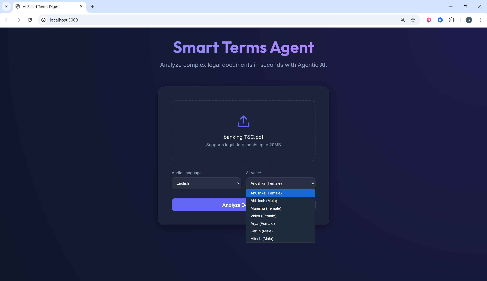
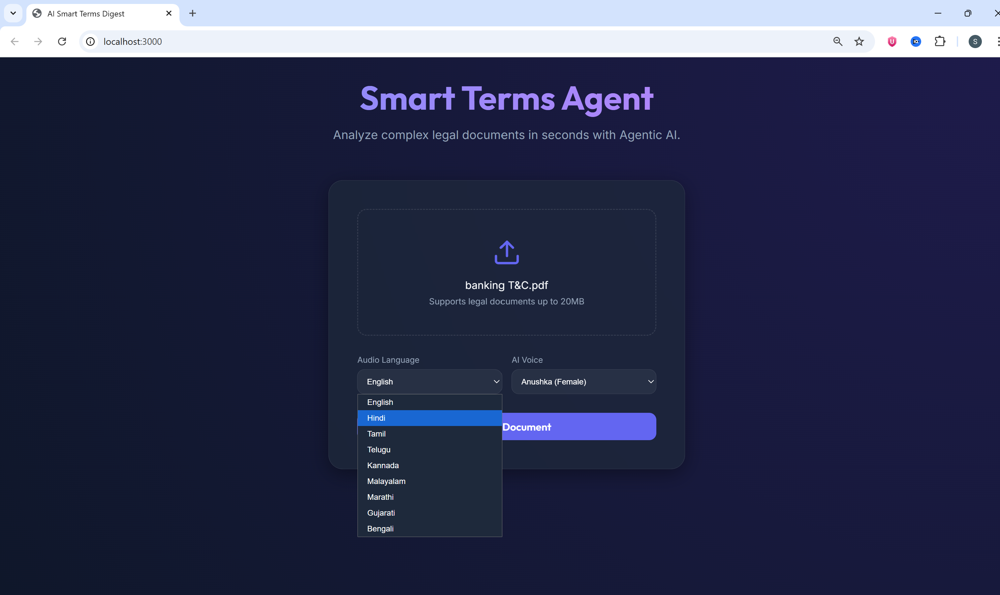
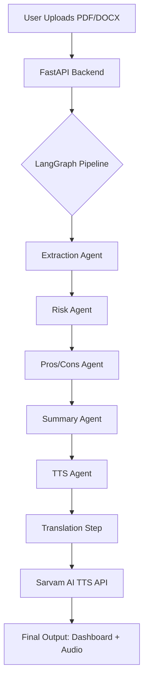

# AI SmartTermsDigest 🛡️🎧

**SmartTermsDigest** is an agentic AI application designed to empower users by simplifying complex legal documents, Terms of Service (ToS), and Privacy Policies. Using a multi-agent orchestration pattern, it analyzes documents for risks, fairness, and key takeaways, providing both a visual dashboard and a multi-lingual audio digest.

## 🚀 Visual Results

| Dashboard Overview | Multi-Lingual Selection |
| :---: | :---: |
|  |  |

| Analysis Detail | Mobile/Responsive view |
| :---: | :---: |
|  |  |

---

## 💼 Business Case

Legal documents and ToS are intentionally long, dense, and difficult to comprehend. Most users "Accept" without reading, exposing themselves to hidden risks, data privacy concerns, and unfair clauses.

**SmartTermsDigest solves this by:**
- **Time Efficiency**: Reducing reading time from hours to seconds.
- **Risk Mitigation**: Highlighting predatory clauses and "hidden" operational risks.
- **Accessibility**: Providing a multi-lingual audio summary for accessibility and on-the-go consumption.
- **Empowerment**: Giving users the clarity needed to make informed consent decisions.

---

## 🏗️ High-Level Architecture

The system utilizes an **Agentic Workflow** orchestrated by **LangGraph**, ensuring a robust and modular analysis pipeline.



- **Frontend**: A modern, glassmorphic React interface (Vite + TS).
- **Backend**: FastAPI service managing file processing and agent orchestration.
- **AI Engine**: 
  - **Gemini 3 Flash Preview**: Powers the reasoning agents and translation.
  - **Sarvam AI**: Provides high-quality Indian-accented Text-to-Speech across 9 languages.

---

## 🛠️ Technology Landscape

| Component | Technology |
| :--- | :--- |
| **Orchestration** | LangGraph, LangChain |
| **LLM** | Google Gemini 3 Flash Preview |
| **TTS Engine** | Sarvam AI (Bulbul v2) |
| **Backend** | Python, FastAPI, Uvicorn |
| **Frontend** | React, TypeScript, Vite, Framer Motion |
| **Styling** | Vanilla CSS (Glassmorphism) |
| **Environment** | UV Package Manager, Dotenv |

---

## 📂 Folder Structure

```text
AI_SmartTermsDigest/
├── backend/                # FastAPI Application
│   ├── app/
│   │   ├── agents/         # LangGraph Agents (Risk, Summary, TTS)
│   │   ├── services/       # External Clients (Gemini, Sarvam)
│   │   └── main.py         # App Entry Point & Routing
│   ├── audio/              # Generated TTS Static Files
│   ├── tests/              # Diagnostic & Validation Scripts
│   └── pyproject.toml      # Backend Dependencies (UV)
├── frontend/               # React Dashboard
│   ├── src/
│   │   ├── services/       # API Integration
│   │   ├── App.tsx         # Main UI Logic
│   │   └── index.css       # Premium Glassmorphic Styles
│   └── vite.config.ts      # Vite Configuration
├── .env                    # Cloud API Keys (Gemini, Sarvam)
└── docker-compose.yml      # Container Orchestration
```

---

## 📖 Operational Run Book

### 1. Prerequisites
- Python 3.11+
- Node.js 18+
- API Keys: [Google AI Studio](https://aistudio.google.com/) & [Sarvam AI](https://www.sarvam.ai/)

### 2. Setup Configuration
Create a `.env` file in the root directory:
```env
GOOGLE_API_KEY=your_gemini_key
SARVAM_API_KEY=your_sarvam_key
```

### 3. Running the Backend
```bash
cd backend
python -m venv .venv
source .venv/bin/activate  # Or .venv\Scripts\activate on Windows
pip install -r requirements.txt
uv run uvicorn app.main:app --reload --port 8000
```

### 4. Running the Frontend
```bash
cd frontend
npm install
npm run dev -- --port 3000
```

### 5. Access
Open [http://localhost:3000](http://localhost:3000) in your browser.

---

## 🛡️ Key Features
- **Multi-Agent Analysis**: Specialized agents for risk, pros/cons, and summarization.
- **Multi-Lingual Audio**: Listen to summaries in 9 Indian languages (Hindi, Tamil, Telugu, etc.).
- **Voice Selection**: Choose between 7 distinct AI voices.
- **Robust Parsing**: Handles markdown-wrapped JSON and long-form document extraction.
- **Premium UI**: Glassmorphic aesthetic with real-time playback pulse animations.
